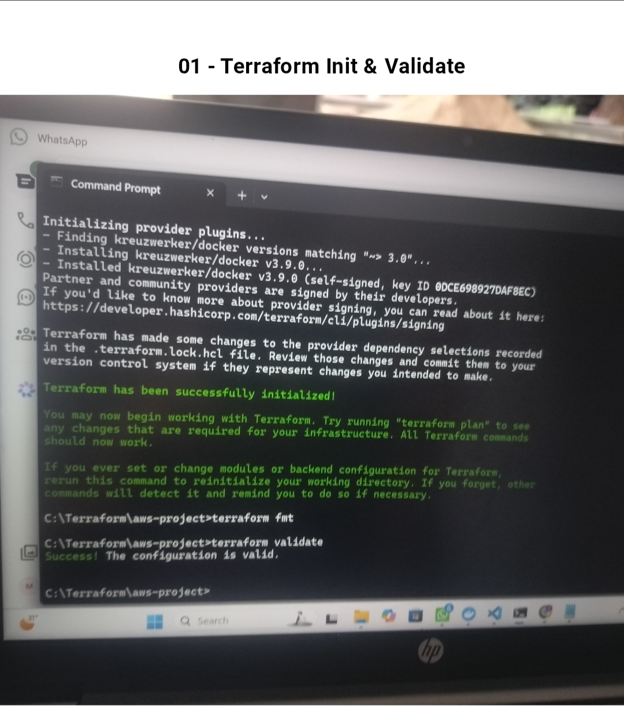
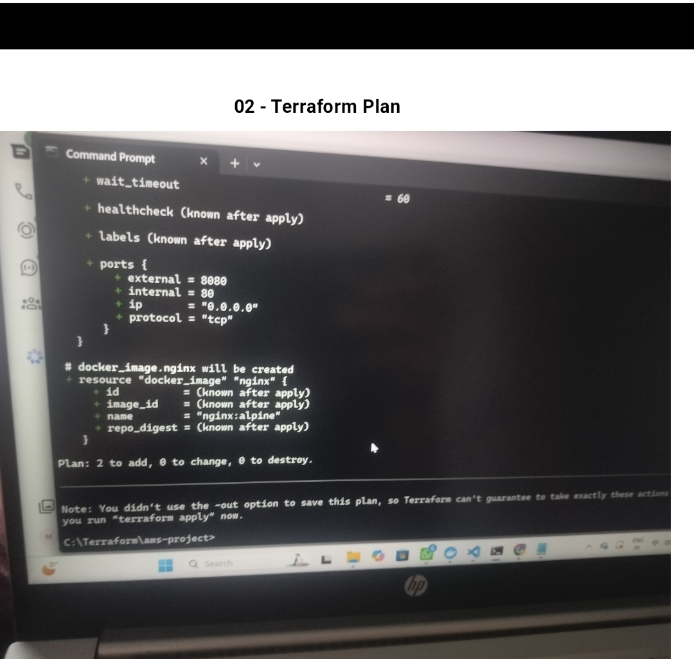
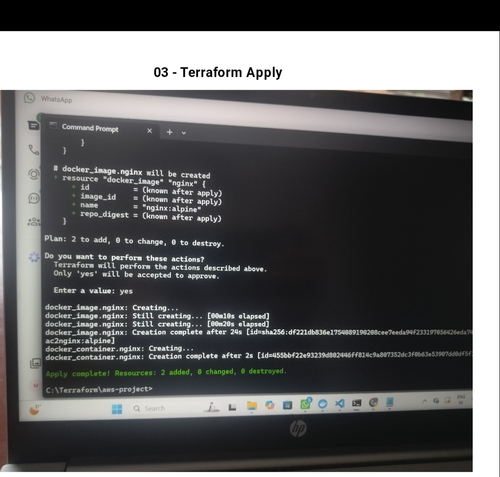
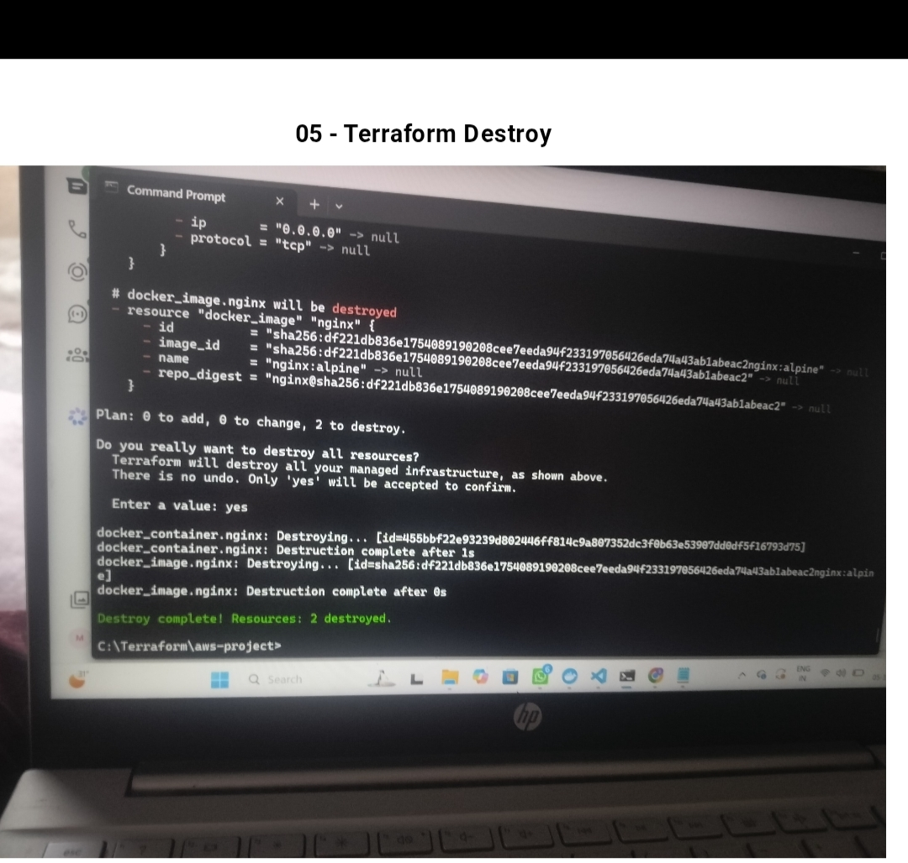

# Terraform Docker Project

## 📌 Task 3 – Provision Docker Container using Terraform

This project demonstrates how to use **Terraform** to provision and manage a Docker container using **Infrastructure as Code (IaC)**.

In this task, Terraform is configured with the Docker provider to create and manage a Docker container. The complete Terraform workflow including initialization, validation, planning, applying and destroying the infrastructure was performed successfully.

---

## 🛠️ Technologies Used

- Terraform
- Docker
- Docker Provider
- Nginx
- Git
- GitHub
- Visual Studio Code

---

## 📂 Project Files

```text
terraform-docker-task3/
│
├── .gitignore
├── .terraform.lock.hcl
├── 01-terraform-init.validate.jpg
├── 02-terraform-plan.jpg
├── 03-terraform-apply.jpg
├── 04-terraform-docker-terraform.jpg
├── 05-terraform-destroy.jpg
└── README.md
```

---

# 🚀 Project Implementation

## 1. Terraform Initialization and Validation

First, the Terraform project was initialized using:

```bash
terraform init
```

Terraform downloaded and initialized the required provider and prepared the working directory.

After initialization, the Terraform configuration was validated using:

```bash
terraform validate
```

The configuration was successfully validated.

### Screenshot



---

## 2. Terraform Plan

After successful initialization and validation, the Terraform execution plan was generated using:

```bash
terraform plan
```

The `terraform plan` command shows the changes Terraform is going to make before actually applying them.

It helps to verify the infrastructure configuration before deployment.

### Screenshot



---

## 3. Terraform Apply

The infrastructure was created using:

```bash
terraform apply
```

Terraform displayed the resources that were going to be created and asked for confirmation.

After providing confirmation, Terraform successfully created the required Docker resources.

### Screenshot



---

## 4. Docker Container Verification

After running `terraform apply`, the Docker container created through Terraform was verified.

Docker commands were used to check the container and confirm that the Terraform-managed Docker resource was successfully created and running.

The Docker container was successfully provisioned using Terraform.

### Screenshot


----

## 5. Terraform Destroy

After completing the deployment and verification, the infrastructure was removed using:

```bash
terraform destroy
```

Terraform displayed the resources that were going to be destroyed and asked for confirmation.

After confirmation, Terraform successfully removed the resources that it had created.

### Screenshot



---

# 🔄 Terraform Workflow

The complete workflow followed in this project was:

```text
Terraform Configuration
        ↓
terraform init
        ↓
terraform validate
        ↓
terraform plan
        ↓
terraform apply
        ↓
Docker Container Created
        ↓
Container Verification
        ↓
terraform destroy
```

---

# 📋 Terraform Commands Used

### Initialize Terraform

```bash
terraform init
```

### Validate Configuration

```bash
terraform validate
```

### Generate Execution Plan

```bash
terraform plan
```

### Apply Infrastructure

```bash
terraform apply
```

### Destroy Infrastructure

```bash
terraform destroy
```

---

# 🎯 Objectives Achieved

- ✅ Terraform was successfully initialized.
- ✅ Terraform configuration was validated.
- ✅ Terraform execution plan was generated.
- ✅ Docker infrastructure was provisioned using Terraform.
- ✅ Docker container was successfully verified.
- ✅ Terraform destroy operation was successfully performed.
- ✅ Complete Infrastructure as Code workflow was implemented.

---

# 💡 Key Learnings

Through this project, I learned:

- Basics of Infrastructure as Code (IaC).
- Terraform project initialization.
- Terraform configuration validation.
- Creating and reviewing an execution plan.
- Provisioning Docker resources using Terraform.
- Managing Docker infrastructure through Terraform.
- Destroying Terraform-managed infrastructure.
- Using GitHub to document and showcase the project.

---

# 📸 Project Screenshots

## Terraform Init & Validate


## Terraform Plan


## Terraform Apply


## Terraform Docker


## Terraform Destroy


---

# 🏁 Conclusion

This project successfully demonstrates the use of **Terraform with Docker** to implement an Infrastructure as Code workflow.

The complete lifecycle was performed successfully:

```text
Initialize → Validate → Plan → Apply → Verify → Destroy
```

This project provided practical experience in using Terraform for automated infrastructure provisioning and management.

---

## 👨‍💻 Project Status

**Status: Completed ✅**

**Task: Terraform + Docker**

**Platform: GitHub**
